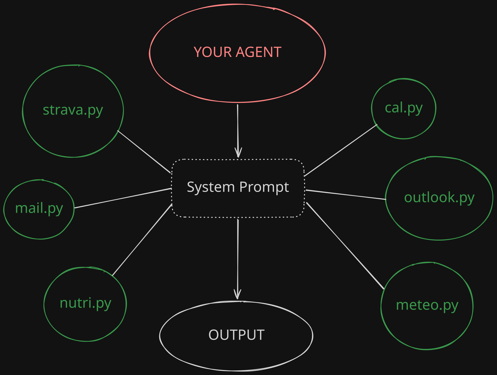

# AI-Connectors

**Ready-to-use connectors between an AI agent and your personal services.**

This collection contains the Python scripts my personal AI agent (a Telegram bot, opencode, etc.) uses to act on the real world: reading email, managing the Apple calendar, logging Strava workouts, checking the weather, tracking nutrition and controlling the Hisense air conditioners at home.

Every connector is:

- **a single stateless CLI script**, callable by any agent via `run_command`/shell
- **zero secrets in code**: all credentials live in a `.env` file (permission `600`) or local token files that are git-ignored
- **self-refreshing** where needed (OAuth refresh tokens, etc.)
- **documented with a ready-made system prompt snippet** to instruct the AI



The **agent** (Telegram bot, opencode, any LLM) is instructed via its **system prompt** about the available skill scripts. Every request flows into the matching connector, which talks to the real service and produces a ready-to-show **output**.

## Included connectors

| Connector | Script | Service | Credentials |
|---|---|---|---|
| 📬 [Mail](connectors/mail/) | `mail.py` | IMAP (Gmail, Outlook OAuth) | `mail.env` + OAuth token |
| 📅 [Calendar](connectors/calendar/) | `cal.py` | Apple iCloud (CalDAV) | Apple ID + app password |
| 🚴 [Strava](connectors/strava/) | `strava.py` | Strava API v3 | OAuth (client id/secret) |
| 🌤️ [Weather](connectors/meteo/) | `meteo.py` | Open-Meteo (free) | none |
| 🥗 [Nutrition](connectors/nutri/) | `nutri.py` | local log + LLM macro estimation | (optional) LLM API key |
| ❄️ [AC / Climate](connectors/clima/) | `ac.py` | Hisense HiSmart Life (Ayla EU cloud) | app credentials |
| 📱 [WhatsApp](connectors/whatsapp/) | `wa.py` | your account via local bridge API | bridge on localhost |
| 📨 [Telegram](connectors/telegram/) | `telegram.py` | real user account (Telethon) | api id/hash + session |

## Quickstart

```bash
git clone https://github.com/BlancoStudioDev/AI-Connectors.git
cd AI-Connectors
./install.sh          # creates ~/agent-scripts, copies the scripts, sets up the venv
```

Then, for each connector you want, follow its `README.md`: create the `.env`, run the one-shot login (if needed), and try it manually before handing it to your agent.

## Instructing the AI

An agent doesn't "discover" scripts on its own: it must be told via the **system prompt**. In [`docs/system-prompt.md`](docs/system-prompt.md) you'll find the complete block (one section per connector) to paste into your bot's system prompt: available commands, when to use them, and safety rules.

## Security — read me

- **Never secrets in code or git.** Everything goes in `.env` (`chmod 600`) or token files (`*_tokens.json`, `*.session`) that `.gitignore` keeps out of the repo.
- Scripts are **read-safe by design** where it matters: Strava is read-only + activity logging, never orders or edits; messaging connectors only act on explicit user request.
- For destructive/irreversible actions the agent must **ask for confirmation** (rule in the system prompt).
- When a token expires, connectors say so clearly in their output instead of failing silently: the agent knows what to tell the user.

## Structure

```
AI-Connectors/
├── README.md                 ← you are here
├── install.sh                ← automatic setup of ~/agent-scripts
├── docs/
│   └── system-prompt.md      ← blocks to paste into your agent's system prompt
└── connectors/
    ├── mail/       mail.py, msft_login.py
    ├── calendar/   cal.py
    ├── strava/     strava.py, strava_login.py
    ├── meteo/      meteo.py
    ├── nutri/      nutri.py
    ├── clima/      ac.py
    ├── whatsapp/   wa.py
    └── telegram/   telegram.py
```

## Adding a new connector

1. Write the CLI script in Python (stdlib where possible, shared venv for deps)
2. Read credentials from `.env`, never hardcode them
3. Make the output readable and *talkative*: the agent will show it to the user as-is
4. Add a `connectors/<name>/` folder with a `README.md` + `.env.example`
5. Add the skill block to `docs/system-prompt.md`

---

MIT license — see [LICENSE](LICENSE).
